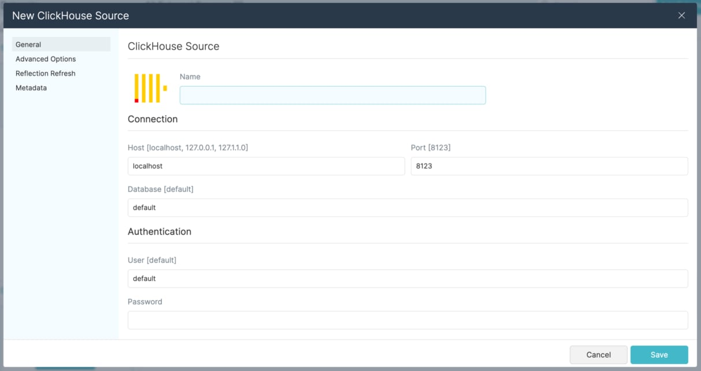

### Dremio ClickHouse Connector

| Tested Dremio Versions | Author                            |
|------------------------|-----------------------------------|
| 19.1.0 to 20.1.0       | Brian Holman <bholman@dezota.com> |

*This independent project is not affiliated with, sponsored, or endorsed by Dremio Corporation or ClickHouse, Inc. "Dremio" is a registered trademark of Dremio Corporation and they retain all trademark and other intellectual property rights.  "Clickhouse" is a trademark of ClickHouse, Inc. and they retain all trademark and other intellectual property rights.  These terms are used here by reference to integrating between their respective platforms.*

The ClickHouse connector allows Dremio to connect to and query data in the high performance ClickHouse Columnar Database.

## Building and Installation

1. In root directory with the pom.xml file run `mvn clean install`
2. Take the resulting `target/dremio-clickhouse-plugin-*.jar` file put it in to the `/opt/dremio/jars` folder of your Dremio installation.  The Clickhouse JDBC Driver is included in the compiled jar and doesn't need to be included separately in `/opt/dremio/jars/3rdparty`. 
3. Restart Dremio

## Docker Instructions
1. Copy `target/dremio-clickhouse-plugin-*.jar` into the `docker` folder.
2. Run `docker-compose build` to take the base Dremio Docker Image and add the new connector.
3. Run `docker-compose up` to start the new image.

## Usage
1. Navigate in Dremio to `External Sources > Add External Source > Clickhouse`
2. Enter the data for your Clickhouse Instance in the source input form.

## Inspiration
*    https://www.dremio.com/resources/tutorials/how-to-create-an-arp-connector/
*    https://github.com/altxcorp/dremio-clickhouse-arp-connector
*    https://github.com/dremio-hub/dremio-sqllite-connector
